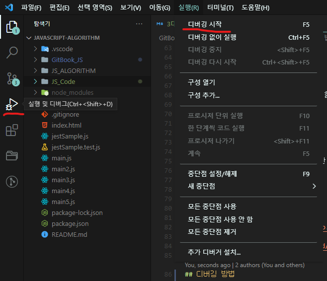

# 디버깅 하는 법

## live server
> 1. vsc 확장에 들어간다.


> 2. live server 검색후 설치한다.


> 3. 하단의 go live 클릭 또는 파일 우측클릭 후 open with Live server click


## vscode 안 터미널에서 작업하는 방법

최상단에 package.json 을 복붙 또는 pull하여 가져온다


터미널을 열고 npm install

```
npm install
```

설치 후
기본 js 파일과 `파일이름.test.js` 로 만든다

ex)

```js
// jestSample.js
function solution(a, b) {
  let answer;
  answer = a + b;
  return answer;
}

module.exports = solution;
```

모듈로 가져와야한다. `module.exports = 함수;`

```js
// jestSample.test.js
const solution = require('./jestSample'); // js 파일명

test('jestSample ', () => {
  const a = 2;
  const b = 3;
  expect(solution(a, b)).toBe(5);
  // toBe, toEqual 등 결과값을 미리 입력해줘야함
});
```

```
npm test
```

실행 결과


npm test 명령어를 쓰면 test.js 다 실행함  
하나의 파일만 디버깅하고 싶을때

```
npm run test ./main2(실행파일)
```

npm run test:watch >>> 자동으로 실시간 감지하여 동작함

```
npm run test:watch ./main2(실행파일)
```

jest 다루기 위해 몇가지 참고해야함
자세한 건 [사이트](https://www.daleseo.com/jest-basic/) 참조

[노드](https://nodejs.org/ko/download/) 필수니 다운받아야 사용가능!

## 디버깅 방법

> 최상단에 .vscode 내에 launch.json.sample 파일을 복사하여 launch.json 으로 수정한다.

원하는 코드 줄에 break point 설정 후 실행



..... 맥은 될려나 모르겟네
맥안되면 말해주셈

